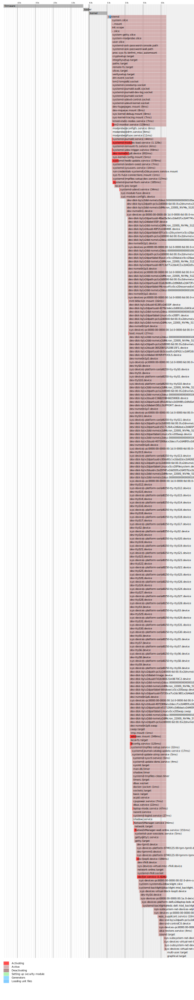

<!-- .slide: data-transition="none" -->

notes: some notes on the main page

--vertical--

# Booting

<!-- .element: style="overflow: scroll; height: 50vh" -->

--vertical--

<!-- .slide: data-transition="none" -->

# Was ist systemd?

--vertical--

<!-- .slide: data-transition="none" -->

| Syntax    | Description |
|-----------|-------------|
| Header    | Title       |
| Paragraph | Text        |

I need to highlight these <mark>very important words</mark>.

X2